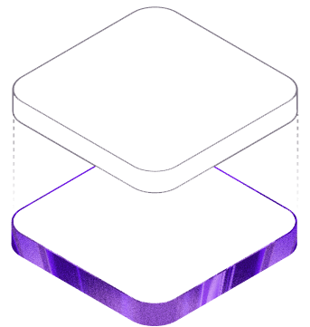
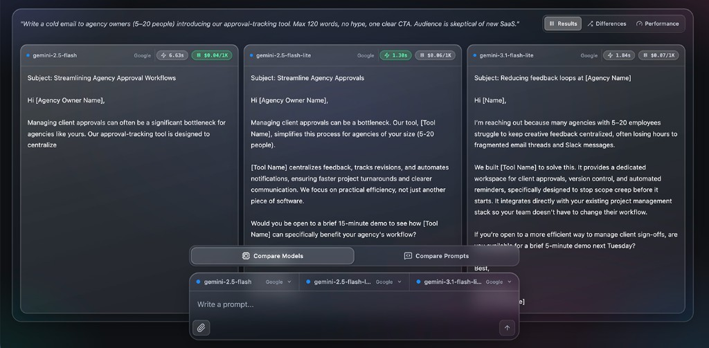
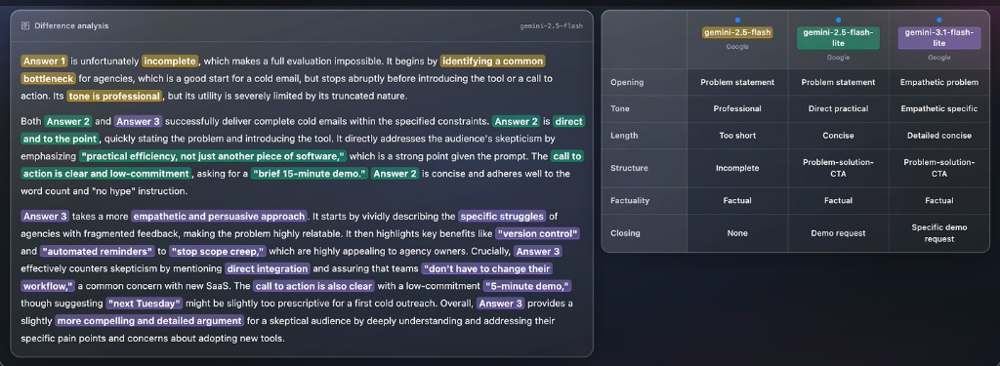
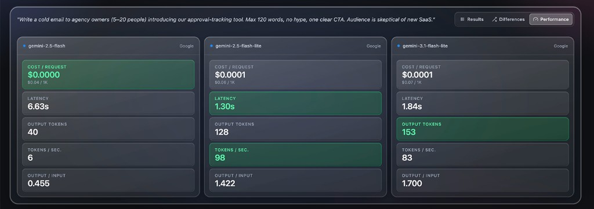
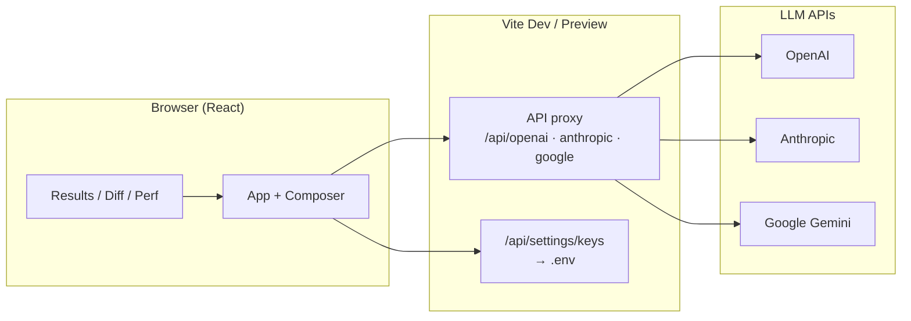

<p align="center">
  
</p>

<h1 align="center">Aidiff</h1>

<p align="center">
  <strong>Compare multiple AI models in parallel — answers, differences, and costs in one place.</strong>
</p>

<p align="center">
  <a href="https://react.dev"></a>
  <a href="https://vite.dev"></a>
  
  
  
</p>

---

## What is Aidiff?

**Aidiff** is a local web app for **side-by-side LLM comparison**. Send the same task to two or three models (or test multiple prompt variants on one model) and get structured output: raw answers, an **AI-powered difference analysis**, and **performance metrics** (latency, tokens, estimated cost).

Great for prompt engineering, model selection, quality checks, and quick A/B tests — without juggling chat tabs.

<p align="center">
  
</p>

---

## Screenshots

### Compare models — composer

<p align="center">
  
</p>

### Compare prompts — A/B test wording

Same model (GPT-4o), two prompt variants: professional vs. casual/direct with extra constraints.

<p align="center">
  
</p>

### Results with composer

Three Gemini variants answering the same cold-email prompt. Latency and cost per column.

<p align="center">
  
</p>

### Difference analysis

<p align="center">
  
</p>

### Performance

<p align="center">
  
</p>

### API keys (local `.env`)

<p align="center">
  
</p>

<p align="center">
  
</p>

---

## Features

| Area | Description |
|------|-------------|
| **Model compare** | 2–3 columns: GPT (OpenAI), Claude (Anthropic), Gemini (Google) — mix freely |
| **Prompt compare** | Same model setup, different prompt variants side by side |
| **Difference analysis** | Auto summary: keywords, mini comparison (tone, length, structure…), assessment — in your prompt’s language |
| **Performance tab** | Latency, output tokens, tokens/s, cost per request (estimate from built-in pricing table) |
| **File attachment** | Attach a local file as extra context in the prompt |
| **Settings** | Manage API keys in the UI; saved to your local `.env` |
| **UI** | Glass design, light/dark mode, searchable model picker with provider catalog |
| **i18n-ready** | Extend UI and analysis prompts via locale files (default: English) |

---

## Quick start

### Prerequisites

- [Node.js](https://nodejs.org/) **18+** (LTS recommended)
- At least **one** API key: [OpenAI](https://platform.openai.com/api-keys), [Anthropic](https://console.anthropic.com/), or [Google AI Studio](https://aistudio.google.com/apikey)

### Install

```bash
git clone https://github.com/<your-user>/aidiff.git
cd aidiff
npm install
cp .env.example .env
```

Add at least one key to `.env`:

```env
ANTHROPIC_API_KEY=sk-ant-...
OPENAI_API_KEY=sk-...
GOOGLE_API_KEY=AIza...
```

Start the dev server:

```bash
npm run dev
```

Open **http://localhost:5173**. On first launch you can also enter keys in **Settings** — they are written to your local `.env`.

---

## Tutorial

### 1. Add API keys

Open **Manage API Keys** (gear in the header). At least one provider is required. Restart the dev server after saving if the proxy does not pick up new keys.

### 2. Choose compare mode

- **Compare Models** — one prompt, different models in 2–3 columns  
- **Compare Prompts** — one model, two (optional three) prompt variants

### 3. Send a prompt

Type your prompt, optionally attach a file, pick models/variants in the slots, press **Send**.

### 4. Read the results

| Tab | Content |
|-----|---------|
| **Results** | Model/variant answers side by side |
| **Differences** | AI analysis: keywords, mini comparison, assessment |
| **Performance** | Latency, cost, and token metrics per column |

Older runs can be collapsed; new comparisons stack below.

---

## Architecture



- **Frontend:** React 18, Vite 5, JSX (no separate backend repo)
- **API access:** In dev and preview, Vite proxies provider requests and injects keys from `.env` server-side — avoids CORS and browser key restrictions
- **Difference analysis:** After a parallel run, Aidiff calls a fixed model (`gemini-2.5-flash`) with structured system prompts; the response is parsed and rendered in the UI
- **Cost estimates:** From `MODEL_PRICING` in `src/constants/appConfig.js` (input/output per 1M tokens)

### Project layout

```
aidiff/
├── docs/screenshots/    # README images (add your PNGs here)
├── public/              # Logo, favicon, static assets
├── src/
│   ├── App.jsx          # Main UI, run orchestration
│   ├── components/      # Composer, tabs, diff cards, settings…
│   ├── constants/       # Providers, models, pricing, tabs
│   ├── i18n/            # Locale catalog, diff-analysis prompts
│   ├── lib/             # API clients, diff parser, model catalog
│   ├── locales/         # UI strings (e.g. en.js)
│   └── theme/           # Design tokens, glass CSS
├── vite.config.js       # Proxy + /api/settings/keys
├── .env.example
└── package.json
```

### NPM scripts

| Command | Description |
|---------|-------------|
| `npm run dev` | Dev server with HMR |
| `npm run build` | Production build to `dist/` |
| `npm run preview` | Preview build locally (proxy active) |
| `npm run lint` | ESLint |

---

## Configuration

### Environment (`.env`)

| Variable | Description |
|----------|-------------|
| `OPENAI_API_KEY` | OpenAI / GPT |
| `ANTHROPIC_API_KEY` | Anthropic / Claude |
| `GOOGLE_API_KEY` | Google Gemini |
| `VITE_AIDIFF_LOCALE` | Optional UI locale (must exist in `src/i18n/catalog.js`, e.g. `en`) |

`.env` is gitignored — **never commit API keys.**

### Add a locale

1. Add `src/locales/de.js` (same shape as `en.js`)
2. Register it in `src/i18n/catalog.js`
3. Set `VITE_AIDIFF_LOCALE=de` or call `setLocale('de')` at runtime

---

## Important notes

- **Local-first:** Keys stay on your machine (`.env`). Aidiff is not a hosted SaaS.
- **Proxy requires Vite:** `/api/settings/keys` and provider proxies run under `npm run dev` and `npm run preview`. Static hosting of `dist/` alone does **not** forward API calls.
- **Costs:** Every run and the difference analysis use API credits on your providers.
- **Meta analysis:** Prepared in code; UI is currently disabled (`META_ANALYSIS_ENABLED`).

---

## Development

```bash
npm install
npm run dev
```

On 401/CORS errors: restart the dev server and check keys in `.env` (no stray spaces). For Google: enable the Generative Language API and billing on your cloud project.

---

## License

Not specified yet — add one (e.g. MIT) if you open-source the repo.

---

<p align="center">
  <sub>Built with React + Vite · See what actually makes models different.</sub>
</p>
